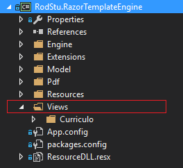
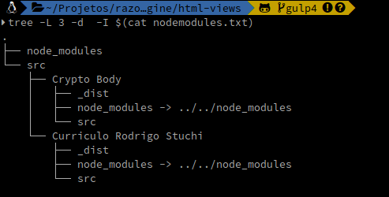
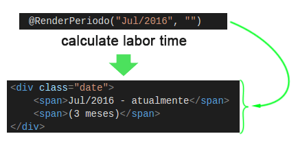
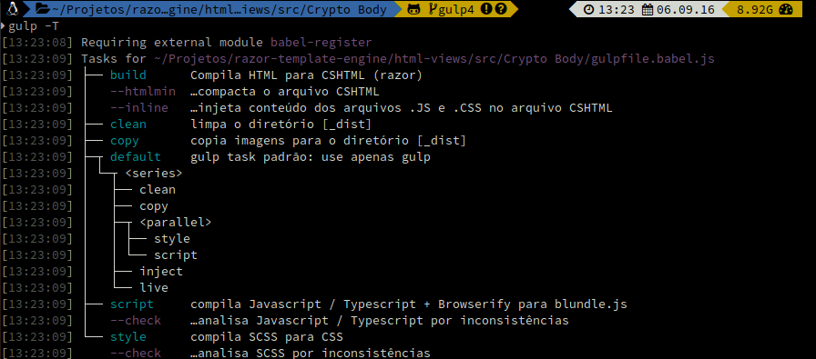

## Building Razor Views

Views for the project **RodStu.RazorTemplateEngine**



#### Restore NPM packages

You will need to have [NodeJS](https://nodejs.org/) **5.x** or grater installed 
with the following packages `gulp 4` and `gulp-cli` globally installed. 

```shell
npm install -g github:gulpjs/gulp#4.0 gulp-cli
cd ../<project-folder>/html-views
npm install
```
Because approximately 80% of the NPM packages are the same in the two projects:



The physical directory *node_modules* stay in the up level of the views projects (cshtml).
In each view project needs to create a <u>symbolic link</u> of *node_modules* pointing to the physical one.

> In this way, the free space won't increase and the installation time is cut by half 
>
>1 `node_modules` for N projects.

In **Windows** execute the file `symbolic_link_node.bat` in each folder of view project as administrator.

```shell	
../html-views/src/Crypto Body/symbolic_link_node.bat
../html-views/src/Curriculo Rodrigo Stuchi/symbolic_link_node.bat
```
In **Linux** go to the directory of each view project, ex:

```shell
cd 'html-views/src/Curriculo Rodrigo Stuchi'
ln -s ../../node_modules node_modules

cd '../Crypto Body'
ln -s ../../node_modules node_modules
```

#### Using Gulp tasks to build and check for errors

```shell	
gulp
```
The `gulp` default task up above will compile and open the browser with *live editing*,
supported by Browser-Sync. Just change any file, save and the content will be injected 
in the browser without the need to refresh the page manually every time by hitting (F5).

```shell
gulp build
```
The `gulp build` task will compile and inject C# content in the HTML, transforming it in CSHTML 
with razor syntax, see the steps bellow:



```shell
gulp style --check
```
The `gulp style --check`will check for incosistency in sass files in this project SCSS files.

type `gulp --tasks` or `gulp -T` to see all tasks available.

