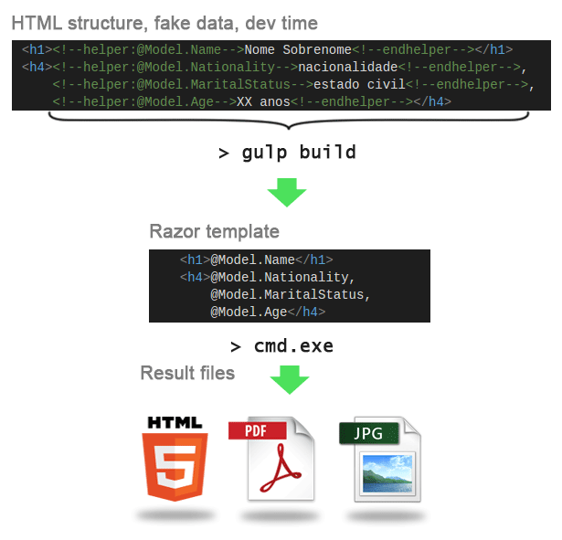
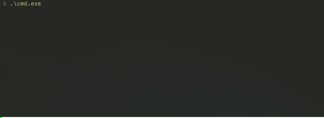
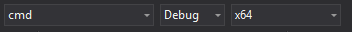

## What is Razor Template Engine

It is a engine that generates PDF and image files based on HTML template files.

## How it works?



## How to use?


Before build the project, it is necessary create a file that will contain the `secret token` 
to protect PDF files. This file must be in the root of user the profile.

#### Open up Powershell

```shell
cd $env:userprofile
new-item .RodStu-razor-secret
```
	
#### Set the password in the secret file 

```shell
notepad.exe .\.RodStu-razor-secret
```

Open up the solution file `Template Engine.sln` in Visual Studio. 

Change `startup project` to **cmd** and change the `solution platform` to **x64**, as the image below:



Build the project.

## Generate files (pdf, html, jpg)

If in Visual Studio, just `Run` the `cmd project` with **F5**.

Or navigate to the `bin` folder:

```shell
cd ..\<project-folder>\cmd\bin\x64
```

To generate HTML, HTML with password, PDF and PDF with password, just do:	

```shell
cmd.exe
```
 
 ## How to create / build Razor views?

 [HOWTO: Building Razor Views](/html-views/readme.md)
